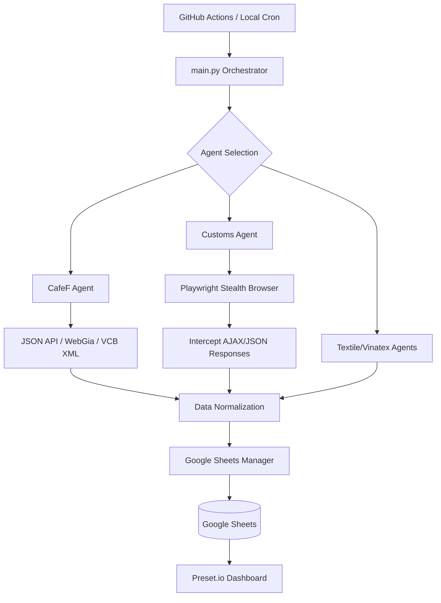

# � SeaBank Data Crawler

Hệ thống crawl dữ liệu tài chính tự động từ 4 nguồn chính: **CafeF**, **Tổng cục Hải quan**, **Hiệp hội Dệt may (VITAS)** và **Vinatex**. Dữ liệu được tổng hợp và đẩy trực tiếp vào Google Sheets để phục vụ báo cáo và phân tích trên Preset.io.

---

## 🚀 Chức năng chính

1.  **Crawl đa nguồn**:
    *   **CafeF**: Giá cổ phiếu (271 mã), Tỷ giá ngoại tệ (VCB), Chỉ số vĩ mô thế giới và Giá vàng (SJC/PNJ).
    *   **Hải Quan**: Kim ngạch xuất nhập khẩu hàng ngày/tháng (vượt rào cản bot bằng Playwright Intercept).
    *   **VITAS & Vinatex**: Tin tức mới nhất trong ngành dệt may.
2.  **Tự động hóa**: Chạy định kỳ hàng ngày thông qua GitHub Actions.
3.  **Lưu trữ tập trung**: Quản lý 8 Tab dữ liệu chuyên biệt trên một Google Sheet duy nhất.
4.  **Cơ chế Robust**: Tự động thử lại (Retry), sử dụng Browser ngầm để xử lý các trang web phức tạp (JavaScript-heavy).

---

## 🏗️ Luồng hoạt động (Operation Flow)



1.  **Kích hoạt**: Pipeline được kích hoạt bởi lịch trình (Cron) hoặc lệnh thủ công.
2.  **Thu thập**: Các Agent thực hiện thu thập dữ liệu. Đối với các trang web khó (Hải quan), hệ thống sử dụng trình duyệt giả lập để "bắt" gói tin dữ liệu thô.
3.  **Chuẩn hóa**: Dữ liệu từ các định dạng khác nhau (JSON, XML, HTML Table) được đưa về dạng bảng chuẩn.
4.  **Lưu trữ**: Dữ liệu được ghi đè hoặc chèn thêm vào các Tab tương ứng trên Google Sheets.

---

## 🛠️ Cài đặt & Sử dụng

### 1. Yêu cầu hệ thống
*   Python 3.10+
*   Google Cloud Service Account (file `excel_key.json`)
*   Playwright (để crawl Hải quan)

### 2. Cài đặt local
```bash
# Clone repo
git clone https://github.com/ntai0404/seabank-crowler.git
cd seabank-crowler

# Cài đặt thư viện
pip install -r requirements.txt

# Cài đặt trình duyệt cho Playwright
playwright install chromium

# Cấu hình .env (Copy từ .env.example)
cp .env.example .env
# Điền SPREADSHEET_ID và đường dẫn file key
```

### 3. Các lệnh chính
*   **Setup Sheet lần đầu** (Tạo các Tab và Header):
    ```bash
    python main.py --setup --agents all
    ```
*   **Crawl toàn bộ**:
    ```bash
    python main.py --agents all
    ```
*   **Crawl riêng lẻ Một Agent**:
    ```bash
    python main.py --agents customs
    ```

---

## ☁️ Hướng dẫn chi tiết thiết lập GitHub Actions

Để hệ thống có thể tự động chạy trên server của GitHub mà không cần máy tính của bạn bật, hãy làm theo 4 bước sau:

### Bước 1: Lấy thông tin cần thiết
1.  **SPREADSHEET_ID**: Mở Google Sheet của bạn, ID là chuỗi ký tự nằm giữa `d/` và `/edit` trên thanh địa chỉ.
    *   Ví dụ: `https://docs.google.com/spreadsheets/d/1abc123.../edit` -> ID là `1abc123...`
2.  **GOOGLE_CREDENTIALS_JSON**: Mở file `excel_key.json` trong thư mục dự án bằng Notepad, copy **toàn bộ** nội dung bên trong (bao gồm cả dấu ngoặc nhọn `{ }`).

### Bước 2: Thêm Secrets vào GitHub
1.  Truy cập vào Repository của bạn trên GitHub: `https://github.com/ntai0404/seabank-crowler`.
2.  Chọn tab **Settings** (Cài đặt) ở thanh menu trên cùng.
3.  Ở cột bên trái, tìm mục **Secrets and variables** -> Chọn **Actions**.
4.  Nhấn nút xanh **New repository secret**.
5.  Thêm lần lượt 2 secret:
    *   **Name**: `SPREADSHEET_ID` | **Value**: (Dán ID vào đây)
    *   **Name**: `GOOGLE_CREDENTIALS_JSON` | **Value**: (Dán toàn bộ nội dung file JSON vào đây)

### Bước 3: Kích hoạt Workflow
1.  Chọn tab **Actions** trên thanh menu GitHub.
2.  Ở cột bên trái, chọn workflow **Daily Data Crawl**.
3.  Nếu thấy thông báo màu vàng, hãy nhấn nút **Enable workflow**.
4.  Để chạy thử ngay lập tức: Nhấn nút **Run workflow** -> Chọn nhánh `main` -> Nhấn nút xanh **Run workflow**.

### Bước 4: Theo dõi kết quả
*   Sau khi nhấn Run, một tiến trình (job) sẽ hiện ra. Bạn có thể nhấn vào đó để xem log chạy thực tế của các Agent.
*   Nếu tất cả các bước hiện tích xanh ✅, dữ liệu đã được đẩy thành công vào Google Sheet.

---

## 📂 Cấu trúc thư mục
*   `agents/`: Chứa mã nguồn của từng Crawler riêng biệt.
*   `core/`: Chứa logic dùng chung (kết nối Sheets, cấu hình, BaseAgent).
*   `plan/`: Chứa tài liệu lập kế hoạch dự án.
*   `logs/`: Lưu trữ log quá trình chạy (đã bị ignore khỏi git).

---
**Author**: ntai0404
**Project**: SeaBank Data Pipeline
